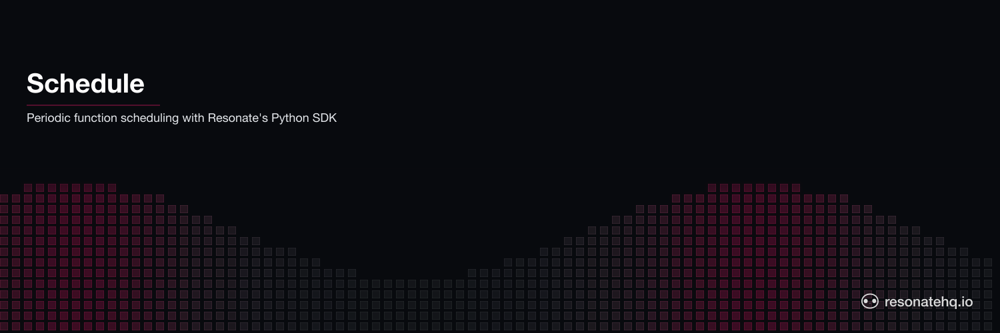

<p align="center">
  <picture>
    <source media="(prefers-color-scheme: dark)" srcset="./assets/banner-dark.png">
    <source media="(prefers-color-scheme: light)" srcset="./assets/banner-light.png">
    
  </picture>
</p>

<p align="center">
  <a href="https://resonatehq.github.io/examples-ci/">
    
  </a>
</p>

# Scheduled Function | Resonate Example

Schedule a Python function to run periodically using Resonate's `schedule()` API.

## What problem does this solve?

Running a function on a cron schedule sounds simple — but in practice, what happens when the worker crashes mid-execution? Traditional cron jobs offer no crash recovery: the job just doesn't run (or runs again from scratch on the next tick). Resonate makes scheduled executions durable. Each cron tick fires a new durable promise. If the worker crashes while processing it, Resonate retries automatically. No lost ticks, no manual recovery logic.

## Overview

This example shows how to use Resonate's `r.schedule()` API to register a function as a periodic job using a cron expression. The Resonate server triggers the function automatically, and a worker processes each execution durably.

```python
import asyncio
import os
from resonate.resonate import Resonate
from report import generate_report

async def main():
    r = Resonate(url=os.environ.get("RESONATE_URL", "http://localhost:8001"))
    r.register(generate_report)

    # Yield to the event loop once so the SDK's background network task
    # starts before the first call (needed until resonate-sdk-py#444 is
    # released).
    await asyncio.sleep(0)

    # Schedule generate_report to run every minute
    await r.schedule(
        id="daily_report",
        cron="* * * * *",
        func_name="generate_report",
        args=(123,),   # user_id
    )
    print("Schedule created. Start the worker to process executions.")
    await r.stop()

asyncio.run(main())
```

## Prerequisites

- Python 3.12+
- [uv](https://docs.astral.sh/uv/) (recommended) or pip
- [Resonate server](https://docs.resonatehq.io) running locally

## Setup

### 1. Start the Resonate server

```bash
resonate dev
```

### 2. Install dependencies

```bash
uv sync
```

### 3. Create the schedule

Run this once to register the cron schedule with the Resonate server:

```bash
uv run python schedule.py
```

### 4. Start the worker

Run the worker to process each scheduled execution:

```bash
uv run python worker.py
```

Every minute, you'll see output like:

```
[2026-02-18T09:00:00] Report for user 123
[2026-02-18T09:01:00] Report for user 123
```

## How It Works

| File | Role |
|------|------|
| `schedule.py` | Creates the cron schedule on the Resonate server (run once) |
| `worker.py` | Registers the function and polls for executions (run continuously) |
| `report.py` | The function that runs on each scheduled tick |

The Resonate server fires a new durable promise on each cron tick. The worker picks it up, executes the function, and records the result. If the worker crashes, Resonate retries the execution automatically.

## Cron Reference

| Expression | Meaning |
|------------|---------|
| `* * * * *` | Every minute |
| `0 9 * * *` | Daily at 9am UTC |
| `0 9 * * MON-FRI` | Weekdays at 9am UTC |
| `*/30 * * * *` | Every 30 minutes |

Cron expressions are evaluated in **UTC**, and the day-of-week field uses Quartz numbering (`1` = Sunday) — prefer day names like `MON-FRI`. See the [Schedules & cron reference](https://docs.resonatehq.io/reference/schedules) for the full expression format.

## Learn More

- [Resonate Documentation](https://docs.resonatehq.io)
- [Schedules API](https://docs.resonatehq.io/reference/schedules)
- [Python SDK Guide](https://docs.resonatehq.io/develop/python)
